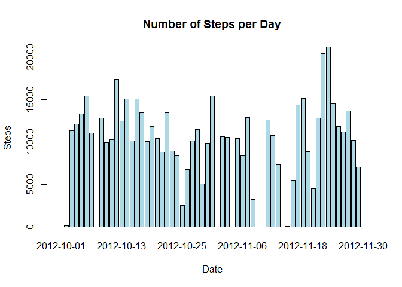
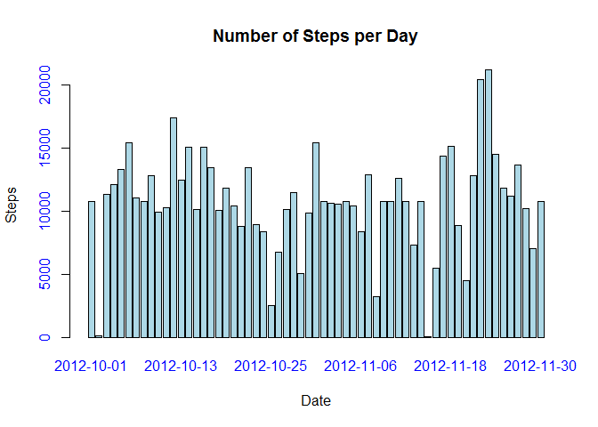
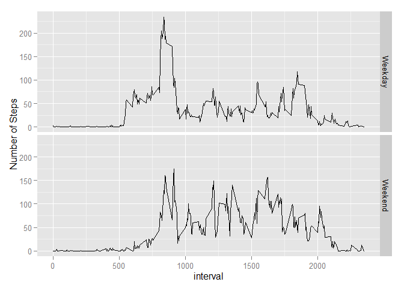

# Reproducible Research: Peer Assessment 1

## Loading and preprocessing the data


```r
activity <- read.csv("activity.csv")
head(activity)
```

```
##   steps       date interval
## 1    NA 2012-10-01        0
## 2    NA 2012-10-01        5
## 3    NA 2012-10-01       10
## 4    NA 2012-10-01       15
## 5    NA 2012-10-01       20
## 6    NA 2012-10-01       25
```

```r
str(activity)
```

```
## 'data.frame':	17568 obs. of  3 variables:
##  $ steps   : int  NA NA NA NA NA NA NA NA NA NA ...
##  $ date    : Factor w/ 61 levels "2012-10-01","2012-10-02",..: 1 1 1 1 1 1 1 1 1 1 ...
##  $ interval: int  0 5 10 15 20 25 30 35 40 45 ...
```
## What is mean total number of steps taken per day?
I use the dplyr package to handle the data and do the calculations.


```r
library(dplyr)
```

```
## 
## Attaching package: 'dplyr'
## 
## The following object is masked from 'package:stats':
## 
##     filter
## 
## The following objects are masked from 'package:base':
## 
##     intersect, setdiff, setequal, union
```

```r
activity$date <- as.Date(activity$date)
str(activity)
```

'data.frame':	17568 obs. of  3 variables:
 $ steps   : int  NA NA NA NA NA NA NA NA NA NA ...
 $ date    : Date, format: "2012-10-01" "2012-10-01" ...
 $ interval: int  0 5 10 15 20 25 30 35 40 45 ...

```r
options(digits=1)
daily_steps <- group_by(activity, date) %>% summarise_each(funs(sum(., na.rm = TRUE)))
barplot(daily_steps$steps, names.arg=daily_steps$date, xlab="Date", ylab="Steps", main="Number of Steps per Day", col="light blue")
```

 

```r
mean <- mean(daily_steps$steps)
median <- median(daily_steps$steps)
```

The mean daily steps was 9354.2, and the median daily steps was 10395.

## What is the average daily activity pattern?
To plot a time series plot average daily steps vs 5 min intervals.


```r
steps_interval <- aggregate(steps~interval, data=activity, FUN= "mean") 
names(steps_interval) <- c("interval", "steps")
plot(steps_interval, type = "l")
```

 

```r
max <- steps_interval$interval[which.max(steps_interval$steps)]
max_steps <- steps_interval$steps[which.max(steps_interval$steps)]
```

The 835's 5-min interval had the max average number of 206.2 steps.

## Imputing missing values
-Calculate the total nubmer of missing values in the data set.


```r
nas <- sum(is.na(activity))
```
The total number of missing values was 2304.

-Fill in the missing values with mean steps and create a new data set.


```r
splt.interval <- split(activity, as.factor(activity$interval))
missing <- is.na(activity$steps)
mean_interval <- sapply(splt.interval, function(x) mean(x$steps, na.rm=T))
days <- length(levels(as.factor(activity$date)))

data1 <- activity
data1[missing, ]$steps <- rep(mean_interval, days)[missing]
```
-Histogram of total steps each day after filled NAs with mean steps


```r
new_daily_steps <- group_by(data1, date) %>% summarise_each(funs(sum(., na.rm = TRUE)))
barplot(new_daily_steps$steps, names.arg=new_daily_steps$date, xlab="Date", ylab="Steps", col.axis="blue", main="Number of Steps per Day", col="light blue")
```

 

```r
options(digits=4)
new_mean <- mean(new_daily_steps$steps)
new_median <- median(new_daily_steps$steps)
```

The mean steps 1.0766\times 10^{4} and median steps 1.0766\times 10^{4} were the same when na's were replaced with average steps.

## Are there differences in activity patterns between weekdays and weekends?
Create weekdays/weekends identifiers


```r
activity$week <- as.factor(ifelse(weekdays(activity$date) %in% c("Saturday","Sunday"), "Weekend", "Weekday"))

meansteps2 <- aggregate(activity$steps, by = list(activity$week, activity$interval), mean, na.rm=TRUE)
mediansteps2 <- aggregate(activity$steps, by = list(activity$week, activity$interval), median, na.rm=TRUE)

intsteps2 <- cbind(meansteps2[], mediansteps2$x)
names(intsteps2) = c("weekday", "interval","mean.steps", "median.steps")

library(ggplot2)

ggplot(intsteps2, aes(x = interval, y = mean.steps)) + ylab("Number of Steps") + geom_line() + facet_grid(weekday~.)
```

 
The patterns show that weekend activities delayed for certain amount of time compared to the weekday pattern.
